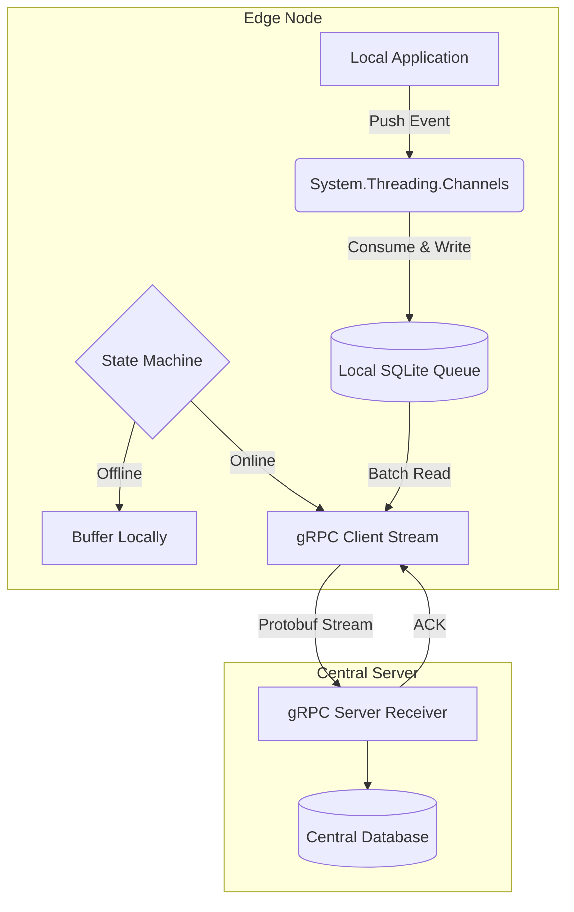

# 🛡️ AegisSync: Resilient Edge-Node Synchronization Engine


A high-throughput, offline-first synchronization daemon built in C#. Designed to run on edge nodes (e.g., industrial tablets, Raspberry Pis, or remote servers) to ensure zero data loss in environments with severe power instability (like loadshedding) and intermittent network connectivity.

## 📖 The Problem

In decentralized environments, edge devices frequently generate critical data (telemetry, transactions, system states). Standard REST APIs fail when the network partitions, leading to lost events or memory-overflow crashes.

## 🚀 The Solution

AegisSync acts as a resilient middleware proxy. Applications on the edge node push data to AegisSync locally. AegisSync queues the data using an in-memory message bus and a local SQLite database, governed by a strict Finite State Machine (FSM). When connectivity is restored, it utilizes gRPC streaming to flush the queue to a central server, requiring explicit acknowledgment (ACK) before removing local records.

## 🧠 Core Architecture



### Key Engineering Decisions
*   **Producer/Consumer Pattern:** Utilizes `System.Threading.Channels` for non-blocking, thread-safe event ingestion capable of handling thousands of events per second without dropping threads.
*   **Finite State Machine (FSM):** Network state logic (Offline, Reconnecting, Syncing, Idle) is strictly decoupled using the State pattern, ensuring predictable transitions and preventing race conditions during intermittent connectivity drops.
*   **gRPC over REST:** Uses HTTP/2 and Protobuf serialization to minimize bandwidth overhead and allow multiplexed bidirectional streaming for faster batch synchronization.
*   **Resilience:** Integrated with `Polly` for exponential backoff and jitter during connection retries to prevent thundering herd problems on the central server when a region's power or network is restored simultaneously.

## 🛠️ Getting Started

You can run the entire distributed system locally using Docker. The configuration spins up both the Central Receiver Server and a simulated Edge Node.

### Prerequisites
*   [Docker Desktop](https://www.docker.com/products/docker-desktop)
*   .NET 8 SDK (if building locally)

### Running the System

1. Clone the repository:
   ```bash
   git clone [https://github.com/yourusername/AegisSync.git](https://github.com/yourusername/AegisSync.git)
   cd AegisSync
   ```

2. Spin up the cluster:
   ```bash
   docker compose up --build
   
```

3. **What you will see:**
   * The `central-server` container will boot on port `50051`.
   * The `edge-node` container will boot and begin generating simulated events.
   * You can simulate a network partition by stopping the central server (`docker stop aegis-central`), watching the edge node seamlessly transition to the `Offline` state and queue data locally, and then restarting the server to watch the gRPC flush sequence.

## 📂 Project Structure

*   `src/AegisSync.Contracts/` - Shared `.proto` files and generated gRPC assets.
*   `src/AegisSync.EdgeNode/` - The C# Worker Service containing the state machine, SQLite repository, and channel channels.
*   `src/AegisSync.CentralServer/` - The gRPC server endpoint for data ingestion and ACK generation.
*   `tests/AegisSync.UnitTests/` - xUnit test suite mocking the local data layer and verifying strict FSM transitions.

## 🤝 License

Distributed under the MIT License. See `LICENSE` for more information.Finite State Machine (FSM): Network state logic (Offline, Reconnecting, Syncing, Idle) is strictly decoupled using the State pattern, ensuring predictable transitions and preventing race conditions during intermittent connectivity drops.
gRPC over REST: Uses HTTP/2 and Protobuf serialization to minimize bandwidth overhead and allow multiplexed bidirectional streaming for faster batch synchronization.
Resilience: Integrated with Polly for exponential backoff and jitter during connection retries to prevent thundering herd problems on the central server when a region's power or network is restored simultaneously.
🛠️ Getting Started
You can run the entire distributed system locally using Docker. The configuration spins up both the Central Receiver Server and a simulated Edge Node.
Prerequisites
Docker Desktop
.NET 8 SDK (if building locally)
Running the System
Clone the repository:
Bash
git clone [https://github.com/yourusername/AegisSync.git](https://github.com/yourusername/AegisSync.git)
cd AegisSync


2. Spin up the cluster:
   ```bash
   docker compose up --build
   


What you will see:
The central-server container will boot on port 50051.
The edge-node container will boot and begin generating simulated events.
You can simulate a network partition by stopping the central server (docker stop aegis-central), watching the edge node seamlessly transition to the Offline state and queue data locally, and then restarting the server to watch the gRPC flush sequence.
📂 Project Structure
src/AegisSync.Contracts/ - Shared .proto files and generated gRPC assets.
src/AegisSync.EdgeNode/ - The C# Worker Service containing the state machine, SQLite repository, and channel channels.
src/AegisSync.CentralServer/ - The gRPC server endpoint for data ingestion and ACK generation.
tests/AegisSync.UnitTests/ - xUnit test suite mocking the local data layer and verifying strict FSM transitions.
🤝 License
Distributed under the MIT License. See LICENSE for more information.

    subgraph central_server [Central Server]
        F -->|Protobuf Stream| G[gRPC Server Receiver]
        G -->|ACK| F
        G --> H[(Central Database)]
    end# 🛡️ AegisSync: Resilient Edge-Node Synchronization Engine


A high-throughput, offline-first synchronization daemon built in C#. Designed to run on edge nodes (e.g., industrial tablets, Raspberry Pis, or remote servers) to ensure zero data loss in environments with severe power instability (like loadshedding) and intermittent network connectivity.

## 📖 The Problem

In decentralized environments, edge devices frequently generate critical data (telemetry, transactions, system states). Standard REST APIs fail when the network partitions, leading to lost events or memory-overflow crashes.

## 🚀 The Solution

AegisSync acts as a resilient middleware proxy. Applications on the edge node push data to AegisSync locally. AegisSync queues the data using an in-memory message bus and a local SQLite database, governed by a strict Finite State Machine (FSM). When connectivity is restored, it utilizes gRPC streaming to flush the queue to a central server, requiring explicit acknowledgment (ACK) before removing local records.

## 🧠 Core Architecture

```mermaid
graph TD
    subgraph edge_node [Edge Node]
        A[Local Application] -->|Push Event| B(System.Threading.Channels)
        B -->|Consume & Write| C[(Local SQLite Queue)]
        D{State Machine} -->|Offline| E[Buffer Locally]
        D -->|Online| F[gRPC Client Stream]
        C -->|Batch Read| F
    end

    subgraph central_server [Central Server]
        F -->|Protobuf Stream| G[gRPC Server Receiver]
        G -->|ACK| F
        G --> H[(Central Database)]
    end

Key Engineering Decisions
Producer/Consumer Pattern: Utilizes System.Threading.Channels for non-blocking, thread-safe event ingestion capable of handling thousands of events per second without dropping threads.
Finite State Machine (FSM): Network state logic (Offline, Reconnecting, Syncing, Idle) is strictly decoupled using the State pattern, ensuring predictable transitions and preventing race conditions during intermittent connectivity drops.
gRPC over REST: Uses HTTP/2 and Protobuf serialization to minimize bandwidth overhead and allow multiplexed bidirectional streaming for faster batch synchronization.
Resilience: Integrated with Polly for exponential backoff and jitter during connection retries to prevent thundering herd problems on the central server when a region's power or network is restored simultaneously.
🛠️ Getting Started
You can run the entire distributed system locally using Docker. The configuration spins up both the Central Receiver Server and a simulated Edge Node.
Prerequisites
Docker Desktop
.NET 8 SDK (if building locally)
Running the System
Clone the repository:
Bash
git clone [https://github.com/yourusername/AegisSync.git](https://github.com/yourusername/AegisSync.git)
cd AegisSync


2. Spin up the cluster:
   ```bash
   docker compose up --build
   


What you will see:
The central-server container will boot on port 50051.
The edge-node container will boot and begin generating simulated events.
You can simulate a network partition by stopping the central server (docker stop aegis-central), watching the edge node seamlessly transition to the Offline state and queue data locally, and then restarting the server to watch the gRPC flush sequence.
📂 Project Structure
src/AegisSync.Contracts/ - Shared .proto files and generated gRPC assets.
src/AegisSync.EdgeNode/ - The C# Worker Service containing the state machine, SQLite repository, and channel channels.
src/AegisSync.CentralServer/ - The gRPC server endpoint for data ingestion and ACK generation.
tests/AegisSync.UnitTests/ - xUnit test suite mocking the local data layer and verifying strict FSM transitions.
🤝 License
Distributed under the MIT License. See LICENSE for more information.
